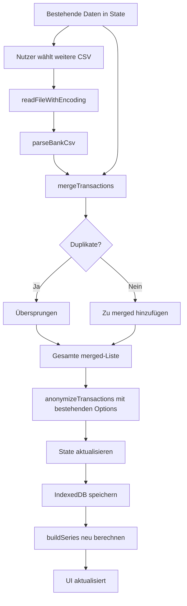

# Multi-File-Import mit Duplikatserkennung

## Übersicht

Die App soll erweitert werden, um nach dem initialen Import weitere CSV-Dateien nachträglich hinzufügen zu können. Dabei müssen folgende Anforderungen erfüllt werden:

1. **Nachträglicher Import**: Weitere Dateien können nach dem ersten Import hinzugefügt werden
2. **Duplikatserkennung**: Identische Transaktionen werden automatisch erkannt und ausgeschlossen
3. **Anonymisierungs-Konsistenz**: Die beim ersten Import gewählten Anonymisierungs-Einstellungen werden beibehalten
4. **Pseudonym-Stabilität**: Bereits anonymisierte Werte behalten ihre Pseudonyme (z.B. IBAN-01 bleibt IBAN-01)

## Aktuelle Architektur

### Datenfluss beim Import

```
CSV-Datei
    ↓
readFileWithEncoding() → Text
    ↓
parseBankCsv() → ParseResult mit Transaction[]
    ↓
anonymizeTransactions() → AnonymizeResult
    ↓
State (transactions) + IndexedDB
    ↓
buildSeries() → Analyse
```

### Kritische Komponenten

- **[`hooks/use-analysis.ts`](hooks/use-analysis.ts:1)**: Zentrale State-Verwaltung
- **[`lib/csv-parser.ts`](lib/csv-parser.ts:1)**: CSV-Parsing
- **[`lib/anonymizer.ts`](lib/anonymizer.ts:1)**: Anonymisierung mit PseudonymRegistry
- **[`lib/local-store.ts`](lib/local-store.ts:1)**: IndexedDB-Persistierung
- **[`components/dashboard.tsx`](components/dashboard.tsx:1)**: UI mit Import/Export-Buttons

## Herausforderungen

### 1. Duplikatserkennung

**Problem**: Transaktionen können in mehreren Exporten enthalten sein (z.B. überlappende Zeiträume).

**Lösung**: Eindeutige Identifikation basierend auf:
- Buchungsdatum (`date`)
- Betrag (`amount`)
- Empfänger (`counterparty`)
- Verwendungszweck (`purpose`)

**Implementierung**:
```typescript
function createTransactionFingerprint(tx: Transaction): string {
  // Normalisierung für robuste Erkennung
  const normalizedCounterparty = tx.counterparty.trim().toLowerCase()
  const normalizedPurpose = tx.purpose.trim().toLowerCase()
  const amountCents = Math.round(tx.amount * 100)
  
  return `${tx.date}|${amountCents}|${normalizedCounterparty}|${normalizedPurpose}`
}
```

**Hinweis**: Die aktuelle Transaction-ID (`tx-${i}-${date}-${Math.round(amount * 100)}`) ist NICHT stabil über mehrere Imports, da der Index `i` variiert.

### 2. Anonymisierungs-Konsistenz

**Problem**: Die [`PseudonymRegistry`](lib/anonymizer.ts:62) in [`anonymizer.ts`](lib/anonymizer.ts:1) ist nur während eines Imports aktiv und wird danach verworfen. Bei einem zweiten Import würde dieselbe IBAN ein anderes Pseudonym erhalten (IBAN-01 → IBAN-03).

**Aktuelle Situation**:
- Anonymisierungs-Optionen werden in [`anonymizeOptions`](hooks/use-analysis.ts:43) State gespeichert
- Die Zuordnung Original → Pseudonym existiert NICHT persistent
- Nach dem Import sind nur noch die Pseudonyme vorhanden

**Lösungsansätze**:

#### Option A: Pseudonym-Mapping persistieren (NICHT EMPFOHLEN)
- Speichern der Zuordnung Original → Pseudonym
- ❌ Sicherheitsrisiko: Originalwerte würden in IndexedDB landen
- ❌ Widerspricht dem Anonymisierungs-Konzept

#### Option B: Reverse-Mapping aus existierenden Daten (EMPFOHLEN)
- Beim zweiten Import: Sammle alle existierenden Pseudonyme aus den gespeicherten Transaktionen
- Initialisiere die PseudonymRegistry mit diesen Werten
- Neue Werte erhalten fortlaufende Nummern

**Implementierung Option B**:
```typescript
function extractExistingPseudonyms(transactions: Transaction[]): Map<string, Set<string>> {
  const pseudonyms = new Map<string, Set<string>>()
  const patterns = {
    IBAN: /\bIBAN-\d{2}\b/g,
    BIC: /\bBIC-\d{2}\b/g,
    VERTRAG: /\bVERTRAG-\d{2}\b/g,
    KARTE: /\bKARTE-\d{2}\b/g,
    EMAIL: /\bEMAIL-\d{2}\b/g,
    TEL: /\bTEL-\d{2}\b/g,
  }
  
  for (const tx of transactions) {
    const text = `${tx.counterparty} ${tx.purpose} ${tx.bookingText}`
    for (const [kind, pattern] of Object.entries(patterns)) {
      const matches = text.match(pattern)
      if (matches) {
        if (!pseudonyms.has(kind)) pseudonyms.set(kind, new Set())
        matches.forEach(m => pseudonyms.get(kind)!.add(m))
      }
    }
  }
  
  return pseudonyms
}

class PersistentPseudonymRegistry extends PseudonymRegistry {
  constructor(existingPseudonyms: Map<string, Set<string>>) {
    super()
    // Initialisiere Counters basierend auf höchster existierender Nummer
    for (const [kind, tokens] of existingPseudonyms) {
      const maxNum = Math.max(0, ...Array.from(tokens).map(t => {
        const match = t.match(/-(\d+)$/)
        return match ? parseInt(match[1], 10) : 0
      }))
      this.counters.set(kind, maxNum)
    }
  }
}
```

**Problem mit Option B**: 
- Wir können nicht wissen, welcher Originalwert zu welchem Pseudonym gehört
- Beim zweiten Import könnte dieselbe IBAN ein NEUES Pseudonym bekommen
- ⚠️ Dies führt zu inkonsistenten Daten und falscher Serienerkennung

#### Option C: Anonymisierung nur beim ersten Import (BESTE LÖSUNG)
- Beim nachträglichen Import: Anonymisierungs-Einstellungen werden BEIBEHALTEN
- ABER: Neue Transaktionen werden mit denselben Einstellungen anonymisiert
- Die PseudonymRegistry startet bei jedem Import neu
- **Konsequenz**: Dieselbe IBAN kann unterschiedliche Pseudonyme haben
- **Akzeptabel**, weil:
  - Die Serienerkennung basiert auf normalisierten Empfängernamen
  - Kleine Unterschiede in Pseudonymen beeinflussen die Gruppierung nicht stark
  - Sicherheit hat Vorrang vor perfekter Konsistenz

**Bessere Variante von Option C**: 
- Beim nachträglichen Import werden die ROHDATEN (vor Anonymisierung) zusammengeführt
- Dann wird die GESAMTE Datenmenge neu anonymisiert
- Dadurch bleiben Pseudonyme konsistent

### 3. Persistierung der Anonymisierungs-Einstellungen

**Aktuell**: [`anonymizeOptions`](hooks/use-analysis.ts:43) ist nur im React-State, wird NICHT in IndexedDB gespeichert.

**Erforderlich**: Speichern in [`StoredState`](lib/local-store.ts:12), damit beim Reload die Einstellungen erhalten bleiben.

## Architektur-Entscheidungen

### Entscheidung 1: Duplikatserkennung

**Gewählt**: Fingerprint-basierte Erkennung mit normalisierten Werten

**Begründung**:
- Robust gegen kleine Formatunterschiede
- Keine Abhängigkeit von instabilen IDs
- Performant mit Set/Map-Lookups

### Entscheidung 2: Anonymisierungs-Konsistenz

**Gewählt**: Re-Anonymisierung der gesamten Datenmenge bei jedem Import

**Begründung**:
- Sicherheit: Keine Speicherung von Original-Pseudonym-Mappings
- Konsistenz: Gleiche Originalwerte erhalten immer gleiche Pseudonyme
- Einfachheit: Keine komplexe Zustandsverwaltung

**Implementierung**:
1. Beim nachträglichen Import: Neue CSV parsen
2. Duplikate entfernen (basierend auf Fingerprint)
3. Neue Transaktionen zu bestehenden hinzufügen
4. GESAMTE Transaktionsliste neu anonymisieren
5. State und IndexedDB aktualisieren

**Nachteil**: Bei großen Datenmengen könnte die Re-Anonymisierung langsam sein
**Mitigation**: Für typische Kontoumsätze (< 10.000 Transaktionen) ist dies vernachlässigbar

### Entscheidung 3: UI-Integration

**Gewählt**: Button "Weitere Datei hinzufügen" im Dashboard-Header

**Begründung**:
- Konsistent mit bestehendem "Importieren/Exportieren"-Pattern
- Sichtbar, aber nicht aufdringlich
- Nutzt bestehende File-Input-Infrastruktur

## Implementierungsplan

### Phase 1: Duplikatserkennung und Merge-Logik

**Dateien**: [`lib/csv-parser.ts`](lib/csv-parser.ts:1), neue Datei `lib/transaction-merger.ts`

**Neue Funktionen**:
```typescript
// lib/transaction-merger.ts

export function createTransactionFingerprint(tx: Transaction): string {
  const normalizedCounterparty = tx.counterparty.trim().toLowerCase()
  const normalizedPurpose = tx.purpose.trim().toLowerCase()
  const amountCents = Math.round(tx.amount * 100)
  return `${tx.date}|${amountCents}|${normalizedCounterparty}|${normalizedPurpose}`
}

export function mergeTransactions(
  existing: Transaction[],
  newTransactions: Transaction[]
): {
  merged: Transaction[]
  duplicates: number
  added: number
} {
  const fingerprints = new Set(existing.map(createTransactionFingerprint))
  const added: Transaction[] = []
  let duplicates = 0
  
  for (const tx of newTransactions) {
    const fp = createTransactionFingerprint(tx)
    if (fingerprints.has(fp)) {
      duplicates++
    } else {
      added.push(tx)
      fingerprints.add(fp)
    }
  }
  
  const merged = [...existing, ...added].sort((a, b) => 
    a.date.localeCompare(b.date)
  )
  
  return { merged, duplicates, added: added.length }
}
```

### Phase 2: Anonymisierungs-Persistierung

**Dateien**: [`lib/local-store.ts`](lib/local-store.ts:1), [`lib/types.ts`](lib/types.ts:1)

**Änderungen**:
```typescript
// lib/types.ts - Erweitern
export type StoredState = {
  transactions: Transaction[]
  overrides: UserOverrides
  fileName: string
  importedAt: string
  anonymizeOptions: AnonymizeOptions  // NEU
  fileNames: string[]  // NEU: Liste aller importierten Dateien
}

// lib/local-store.ts - Anpassen
export function normalizeStoredState(stored: any): StoredState {
  return {
    transactions: stored?.transactions ?? [],
    overrides: normalizeOverrides(stored?.overrides),
    fileName: stored?.fileName ?? '',
    importedAt: stored?.importedAt ?? '',
    anonymizeOptions: stored?.anonymizeOptions ?? DEFAULT_ANONYMIZE_OPTIONS,
    fileNames: stored?.fileNames ?? (stored?.fileName ? [stored.fileName] : []),
  }
}
```

### Phase 3: Hook-Erweiterung

**Dateien**: [`hooks/use-analysis.ts`](hooks/use-analysis.ts:1)

**Neue Funktion**:
```typescript
const addFile = useCallback(
  async (file: File) => {
    setIsLoading(true)
    setError(null)
    
    try {
      // 1. CSV parsen
      const text = await readFileWithEncoding(file)
      const result = parseBankCsv(text)
      
      if (result.transactions.length === 0) {
        setError('Keine Transaktionen in der Datei gefunden.')
        return
      }
      
      // 2. Duplikate entfernen und mergen
      const { merged, duplicates, added } = mergeTransactions(
        transactions,
        result.transactions
      )
      
      // 3. Gesamte Datenmenge neu anonymisieren
      const anonymized = anonymizeTransactions(merged, anonymizeOptions)
      
      // 4. State aktualisieren
      setTransactions(anonymized.transactions)
      setFileName(prev => `${prev} + ${file.name}`)
      setFileNames(prev => [...prev, file.name])
      
      // 5. Feedback
      alert(
        `Import erfolgreich!\n\n` +
        `Neue Transaktionen: ${added}\n` +
        `Duplikate übersprungen: ${duplicates}`
      )
      
    } catch (err) {
      console.error('[addFile] failed:', err)
      setError('Fehler beim Hinzufügen der Datei.')
    } finally {
      setIsLoading(false)
    }
  },
  [transactions, anonymizeOptions]
)
```

### Phase 4: UI-Komponente

**Dateien**: [`components/dashboard.tsx`](components/dashboard.tsx:1)

**Änderungen**:
```typescript
// Neuer Button im Header (Zeile 165-190)
<Button 
  variant="ghost" 
  size="sm" 
  onClick={handleAddFileClick} 
  title="Weitere CSV-Datei hinzufügen"
>
  <PlusIcon data-icon="inline-start" />
  Datei hinzufügen
</Button>
<input
  ref={addFileInputRef}
  type="file"
  accept=".csv,.txt,text/csv"
  onChange={handleAddFileSelected}
  className="hidden"
  aria-hidden="true"
/>
```

**Feedback-Dialog**: Anzeige der Import-Statistik (neue/doppelte Transaktionen)

### Phase 5: Testing-Szenarien

1. **Basis-Test**: Zwei identische Dateien importieren → Alle Duplikate erkannt
2. **Überlappung**: Datei mit 50% Überlappung → Nur neue Transaktionen hinzugefügt
3. **Anonymisierung**: Gleiche IBAN in beiden Dateien → Gleiches Pseudonym
4. **Sortierung**: Transaktionen bleiben chronologisch sortiert
5. **Persistierung**: Nach Reload sind alle Daten und Einstellungen vorhanden

## Datenfluss-Diagramm



## Sicherheitsüberlegungen

### Anonymisierungs-Konsistenz vs. Sicherheit

**Konflikt**: 
- Für konsistente Pseudonyme müssten wir Original→Pseudonym-Mappings speichern
- Dies würde die Anonymisierung teilweise aufheben

**Lösung**:
- Re-Anonymisierung der gesamten Datenmenge
- Gleiche Originalwerte → Gleiche Pseudonyme (innerhalb einer Sitzung)
- Keine Speicherung von Mappings

**Akzeptierte Einschränkung**:
- Nach einem "Daten löschen" und erneutem Import können Pseudonyme unterschiedlich sein
- Dies ist akzeptabel, da es sich um eine neue Analyse-Sitzung handelt

## Offene Fragen

1. **Soll der Nutzer gefragt werden, ob Duplikate übersprungen werden sollen?**
   - Vorschlag: Nein, automatisch überspringen mit Info-Meldung
   
2. **Soll es eine Übersicht aller importierten Dateien geben?**
   - Vorschlag: Ja, im Header als Tooltip oder erweiterbarer Bereich
   
3. **Soll der Nutzer einzelne Dateien wieder entfernen können?**
   - Vorschlag: Nein (zu komplex), stattdessen "Daten löschen" und neu beginnen

4. **Was passiert, wenn die zweite Datei andere Anonymisierungs-Einstellungen erfordern würde?**
   - Vorschlag: Die Einstellungen vom ersten Import werden beibehalten
   - Alternative: Dialog anzeigen, der die Einstellungen zeigt und Bestätigung erfordert

## Zusammenfassung

Die Implementierung erfordert:

1. ✅ **Neue Datei**: `lib/transaction-merger.ts` für Duplikatserkennung
2. ✅ **Erweiterung**: [`lib/types.ts`](lib/types.ts:1) und [`lib/local-store.ts`](lib/local-store.ts:1) für Persistierung
3. ✅ **Erweiterung**: [`hooks/use-analysis.ts`](hooks/use-analysis.ts:1) mit `addFile`-Funktion
4. ✅ **Erweiterung**: [`components/dashboard.tsx`](components/dashboard.tsx:1) mit neuem Button
5. ✅ **Anpassung**: Re-Anonymisierung bei jedem Merge

**Geschätzter Aufwand**: Mittel (ca. 4-6 Stunden)

**Risiken**: 
- Gering: Duplikatserkennung könnte bei sehr ähnlichen Transaktionen fehlschlagen
- Mitigation: Fingerprint-Algorithmus kann bei Bedarf verfeinert werden

**Vorteile**:
- Nutzer können Daten schrittweise importieren
- Keine Sorge vor doppelten Einträgen
- Anonymisierung bleibt konsistent und sicher
