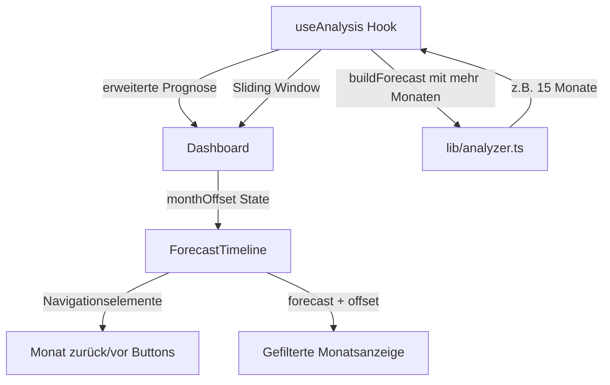

# Plan: Verschiebbare Startmonat-Funktion für Fixkosten-Prognose

## Anforderung

Die App zeigt aktuell die Fixkosten-Prognose für die nächsten 3 Monate an. Der Nutzer möchte den Startmonat verschieben können, um auch vergangene Monate anzuzeigen.

## Aktuelle Implementierung

### Prognose-Berechnung ([`lib/analyzer.ts`](../lib/analyzer.ts:587-671))

Die Funktion [`buildForecast()`](../lib/analyzer.ts:587) erstellt die Prognose:

```typescript
export function buildForecast(
  series: Series[],
  referenceDate: string,      // Heute oder letztes Buchungsdatum
  categories: Category[],
  monthCount = 3,              // Fest: 3 Monate
  minConfidence = 0.35,
): ForecastMonth[]
```

**Logik:**
- Startet am **1. des Folgemonats** nach `referenceDate`
- Erzeugt `monthCount` Monate (aktuell 3)
- Filtert nur aktive Serien mit `bucket: 'fixed'`
- Berechnet erwartete Buchungen basierend auf Intervallen

### Verwendung im Hook ([`hooks/use-analysis.ts`](../hooks/use-analysis.ts:92-95))

```typescript
const forecast = useMemo(
  () => buildForecast(series, referenceDate, categories, 3),
  [series, referenceDate, categories],
)
```

**Problem:** Der Startmonat ist fest an `referenceDate` gekoppelt.

### Anzeige ([`components/forecast-timeline.tsx`](../components/forecast-timeline.tsx:84-181))

Die Komponente zeigt 3 Karten (Monate) in einem Grid an. Keine Navigation vorhanden.

## Lösungskonzept

### Architektur-Übersicht



### Strategie: Sliding Window

**Ansatz:** Berechne eine **erweiterte Prognose** (z.B. 15 Monate: 12 zurück + 3 vorwärts) und zeige davon ein **3-Monats-Fenster** an.

**Vorteile:**
- Keine Änderung der Core-Logik in [`buildForecast()`](../lib/analyzer.ts:587)
- Einfaches State-Management (nur Offset)
- Performance: Berechnung nur bei Datenänderung

**Nachteile:**
- Vergangene Monate zeigen "erwartete" statt "tatsächliche" Buchungen
- Keine Abgleich mit bereits gebuchten Transaktionen

## Implementierungsplan

### 1. Erweiterte Prognose-Berechnung

**Datei:** [`hooks/use-analysis.ts`](../hooks/use-analysis.ts:92-95)

**Änderungen:**
- Berechne erweiterte Prognose mit mehr Monaten
- Füge `monthOffset` State hinzu
- Erstelle gefilterte Prognose basierend auf Offset

```typescript
// Neu: State für Monat-Offset
const [monthOffset, setMonthOffset] = useState(0)

// Erweiterte Prognose: 12 Monate zurück + 3 vorwärts = 15 Monate
const extendedForecast = useMemo(
  () => buildForecast(series, referenceDate, categories, 15, 0.35, -12),
  [series, referenceDate, categories],
)

// Sichtbare Prognose: 3-Monats-Fenster
const forecast = useMemo(() => {
  const startIndex = 12 + monthOffset // 12 = Offset für "heute"
  return extendedForecast.slice(startIndex, startIndex + 3)
}, [extendedForecast, monthOffset])
```

### 2. Anpassung der buildForecast-Funktion

**Datei:** [`lib/analyzer.ts`](../lib/analyzer.ts:587-671)

**Änderungen:**
- Neuer Parameter `startMonthOffset` (Standard: 0)
- Startmonat-Berechnung anpassen

```typescript
export function buildForecast(
  series: Series[],
  referenceDate: string,
  categories: Category[],
  monthCount = 3,
  minConfidence = 0.35,
  startMonthOffset = 0,  // NEU: Negativ = Vergangenheit, Positiv = Zukunft
): ForecastMonth[]
```

**Logik-Anpassung:**
```typescript
// Statt: Start am 1. des Folgemonats
// Neu: Start am 1. des (Folgemonat + Offset)
for (let i = 0; i < monthCount; i++) {
  const monthDate = new Date(
    Date.UTC(
      start.getUTCFullYear(), 
      start.getUTCMonth() + i + 1 + startMonthOffset,  // + startMonthOffset
      1
    ),
  )
  // ...
}
```

### 3. UI-Komponente für Navigation

**Datei:** [`components/forecast-timeline.tsx`](../components/forecast-timeline.tsx:32-40)

**Neue Props:**
```typescript
type ForecastTimelineProps = {
  forecast: ForecastMonth[]
  categories: Category[]
  series?: Series[]
  seriesNames?: Record<string, string>
  paidEntries?: Record<string, boolean>
  onNameChange?: (seriesKey: string, name: string | null) => void
  onTogglePaid?: (month: string, seriesKey: string) => void
  // NEU:
  monthOffset?: number
  onMonthOffsetChange?: (offset: number) => void
  canNavigateBack?: boolean
  canNavigateForward?: boolean
}
```

**UI-Elemente:**
```typescript
// Vor dem Grid mit den Monatskarten
<div className="flex items-center justify-between mb-4">
  <Button
    variant="outline"
    size="sm"
    onClick={() => onMonthOffsetChange?.(monthOffset - 1)}
    disabled={!canNavigateBack}
  >
    <ChevronLeftIcon /> Vorheriger Monat
  </Button>
  
  <div className="text-sm text-muted-foreground">
    {monthOffset === 0 ? 'Aktuelle Prognose' : 
     monthOffset < 0 ? `${Math.abs(monthOffset)} Monat(e) zurück` :
     `${monthOffset} Monat(e) voraus`}
  </div>
  
  <Button
    variant="outline"
    size="sm"
    onClick={() => onMonthOffsetChange?.(monthOffset + 1)}
    disabled={!canNavigateForward}
  >
    Nächster Monat <ChevronRightIcon />
  </Button>
</div>
```

### 4. Dashboard-Integration

**Datei:** [`components/dashboard.tsx`](../components/dashboard.tsx:253-262)

**Änderungen:**
```typescript
<TabsContent value="forecast" className="pt-4">
  <ForecastTimeline
    forecast={forecast}
    categories={categories}
    series={series}
    seriesNames={props.overrides.names}
    paidEntries={props.overrides.paid}
    onNameChange={setSeriesName}
    onTogglePaid={togglePaid}
    // NEU:
    monthOffset={monthOffset}
    onMonthOffsetChange={setMonthOffset}
    canNavigateBack={monthOffset > -12}
    canNavigateForward={monthOffset < 0}
  />
</TabsContent>
```

### 5. Visuelle Unterscheidung

**Vergangene vs. Zukünftige Monate:**

```typescript
// In ForecastTimeline
const isHistorical = monthOffset < 0
const isFuture = monthOffset > 0

<Card 
  key={month.month} 
  className={cn(
    "flex flex-col",
    isHistorical && "border-muted-foreground/30 bg-muted/20",
    isFuture && "border-primary/30"
  )}
>
  <CardHeader className="gap-2">
    <div className="flex items-baseline justify-between gap-2">
      <CardTitle className="text-base flex items-center gap-2">
        {month.monthLabel}
        {isHistorical && (
          <Badge variant="outline" className="text-xs">
            Vergangenheit
          </Badge>
        )}
      </CardTitle>
      {/* ... */}
    </div>
  </CardHeader>
  {/* ... */}
</Card>
```

## Erweiterte Features (Optional)

### A. Abgleich mit tatsächlichen Buchungen

Für vergangene Monate: Zeige, welche Prognosen tatsächlich eingetroffen sind.

```typescript
// In buildForecast oder separater Funktion
function matchForecastWithActuals(
  forecast: ForecastMonth[],
  transactions: Transaction[],
  series: Series[]
): ForecastMonth[] {
  // Für jeden Prognose-Eintrag:
  // - Suche passende Transaktion im Monat
  // - Markiere als "bezahlt" oder "ausgeblieben"
  // - Zeige Differenz zwischen erwartet/tatsächlich
}
```

### B. Schnellnavigation

```typescript
<Select value={monthOffset.toString()} onValueChange={(v) => setMonthOffset(Number(v))}>
  <SelectTrigger className="w-48">
    <SelectValue />
  </SelectTrigger>
  <SelectContent>
    <SelectItem value="-12">12 Monate zurück</SelectItem>
    <SelectItem value="-6">6 Monate zurück</SelectItem>
    <SelectItem value="-3">3 Monate zurück</SelectItem>
    <SelectItem value="0">Aktuelle Prognose</SelectItem>
    <SelectItem value="3">3 Monate voraus</SelectItem>
  </SelectContent>
</Select>
```

### C. Keyboard-Navigation

```typescript
useEffect(() => {
  const handleKeyPress = (e: KeyboardEvent) => {
    if (e.key === 'ArrowLeft' && canNavigateBack) {
      setMonthOffset(prev => prev - 1)
    } else if (e.key === 'ArrowRight' && canNavigateForward) {
      setMonthOffset(prev => prev + 1)
    }
  }
  window.addEventListener('keydown', handleKeyPress)
  return () => window.removeEventListener('keydown', handleKeyPress)
}, [canNavigateBack, canNavigateForward])
```

## Dateien, die geändert werden müssen

### Core-Logik
1. **[`lib/analyzer.ts`](../lib/analyzer.ts:587-671)**
   - `buildForecast()`: Parameter `startMonthOffset` hinzufügen
   - Startmonat-Berechnung anpassen

### State-Management
2. **[`hooks/use-analysis.ts`](../hooks/use-analysis.ts:92-95)**
   - `monthOffset` State hinzufügen
   - Erweiterte Prognose berechnen (15 Monate)
   - Gefilterte Prognose basierend auf Offset
   - `setMonthOffset` exportieren

### UI-Komponenten
3. **[`components/forecast-timeline.tsx`](../components/forecast-timeline.tsx:32-40)**
   - Props erweitern (`monthOffset`, `onMonthOffsetChange`, etc.)
   - Navigations-UI hinzufügen
   - Visuelle Unterscheidung für vergangene/zukünftige Monate

4. **[`components/dashboard.tsx`](../components/dashboard.tsx:253-262)**
   - `monthOffset` State durchreichen
   - Navigation-Props an `ForecastTimeline` übergeben

## Technische Überlegungen

### Performance
- **Berechnung:** Erweiterte Prognose (15 Monate) hat minimalen Overhead
- **Memoization:** `useMemo` verhindert unnötige Neuberechnungen
- **Rendering:** Nur 3 Monate werden gleichzeitig gerendert

### Datenkonsistenz
- **Vergangene Monate:** Zeigen Prognose, nicht tatsächliche Buchungen
- **Hinweis:** Nutzer sollte verstehen, dass es sich um "erwartete" Werte handelt
- **Zukünftige Erweiterung:** Abgleich mit tatsächlichen Transaktionen

### Benutzerfreundlichkeit
- **Standardansicht:** Offset = 0 (aktuelle Prognose)
- **Persistierung:** Optional `monthOffset` in LocalStorage speichern
- **Reset-Button:** Schnell zurück zur aktuellen Prognose

## Zusammenfassung

Die Implementierung erfolgt in **4 Schritten**:

1. **Erweitere [`buildForecast()`](../lib/analyzer.ts:587)** um `startMonthOffset`-Parameter
2. **Füge State-Management** in [`useAnalysis`](../hooks/use-analysis.ts:33) hinzu
3. **Implementiere Navigation-UI** in [`ForecastTimeline`](../components/forecast-timeline.tsx:32)
4. **Verbinde alles** im [`Dashboard`](../components/dashboard.tsx:253)

**Aufwand:** Überschaubar, da die Core-Logik wiederverwendet wird.

**Ergebnis:** Nutzer kann durch vergangene und zukünftige Monate navigieren und die erwarteten Fixkosten für jeden Zeitraum sehen.
